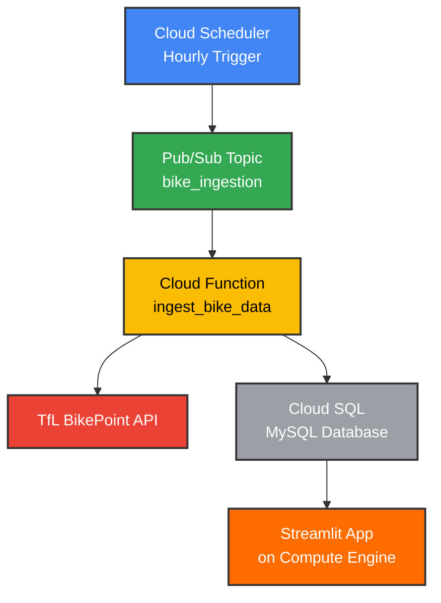

# 🚴 London Bike Availability Data Pipeline

A real-time data pipeline built on Google Cloud Platform to collect, process, and visualize London bike availability data from the TfL BikePoint API.

## 📊 Live Dashboard
🔗 **[View Live Streamlit App](https://gcp-tfl-pipeline.streamlit.app/)**

## 🏗️ Architecture Overview



## ✨ Features

- 🕐 **Automated hourly data collection** from TfL BikePoint API
- 📈 **Real-time visualization** with interactive Streamlit dashboard
- 🏪 **Historical data storage** for trend analysis
- ☁️ **Fully cloud-native** architecture on Google Cloud Platform
- 🛠️ **Infrastructure as Code** with Terraform

## 🚀 Tech Stack

### Google Cloud Platform
- **Cloud Scheduler** - Automated job triggering
- **Pub/Sub** - Event-driven messaging
- **Cloud Functions** - Serverless data processing
- **Cloud SQL (MySQL)** - Managed database storage
- **Compute Engine** - Application hosting

### External Services & Tools
- **TfL BikePoint API** - Real-time bike availability data
- **Streamlit** - Interactive web application framework
- **Terraform** - Infrastructure automation
- **Python 3.8+** - Core programming language

## 📋 Prerequisites

Before you begin, ensure you have:

- [ ] Google Cloud Platform account with billing enabled
- [ ] TfL API Application ID and Key ([Register here](https://api-portal.tfl.gov.uk/))
- [ ] Terraform installed locally
- [ ] Python 3.8+ installed
- [ ] Git installed

## 🛠️ Installation & Setup

### 1. Clone the Repository
```bash
git clone https://github.com/yourusername/london-bike-data-pipeline.git
cd london-bike-data-pipeline
```

### 2. Set Up Google Cloud Project
```bash
# Set your project ID
export PROJECT_ID="your-gcp-project-id"
gcloud config set project $PROJECT_ID

# Enable required APIs
gcloud services enable cloudfunctions.googleapis.com
gcloud services enable cloudscheduler.googleapis.com
gcloud services enable pubsub.googleapis.com
gcloud services enable sqladmin.googleapis.com
```

### 3. Configure Environment Variables
```bash
cp .env.example .env
# Edit .env with your TfL API credentials and GCP settings
```

### 4. Deploy Infrastructure
```bash
cd terraform/
terraform init
terraform plan
terraform apply
```

### 5. Deploy Cloud Function
```bash
cd ../functions/
gcloud functions deploy ingest_bike_data \
  --runtime python39 \
  --trigger-topic bike_ingestion \
  --env-vars-file .env.yaml
```

### 6. Run Streamlit App
```bash
cd ../streamlit/
pip install -r requirements.txt
streamlit run app.py
```

## 📊 Dashboard Features

The Streamlit dashboard provides:

- **📍 Station Overview** - Total available bikes and docking stations
- **🗺️ Interactive Map** - Real-time station locations and availability
- **📈 Time Series Analysis** - Historical availability trends
- **🏆 Top Stations** - Most/least popular bike stations
- **⏰ Peak Hours Analysis** - Usage patterns throughout the day

## 📁 Project Structure

```
london-bike-data-pipeline/
├── 📂 functions/           # Cloud Functions code
│   ├── main.py
│   ├── requirements.txt
│   └── .env.yaml
├── 📂 streamlit/          # Streamlit dashboard
│   ├── app.py
│   ├── requirements.txt
│   └── utils/
├── 📂 terraform/          # Infrastructure as Code
│   ├── main.tf
│   ├── variables.tf
│   └── outputs.tf
├── 📂 sql/               # Database schemas
│   └── init.sql
├── 📄 README.md
├── 📄 .gitignore
└── 📄 requirements.txt
```

## 🔧 Configuration

### Cloud Scheduler
- **Frequency**: Hourly (`0 * * * *`)
- **Target**: Pub/Sub topic `bike_ingestion`
- **Timezone**: Europe/London

### Database Schema
```sql
CREATE TABLE bike_stations (
    id INT AUTO_INCREMENT PRIMARY KEY,
    station_id VARCHAR(50),
    common_name VARCHAR(255),
    lat DECIMAL(10, 8),
    lon DECIMAL(11, 8),
    bikes_available INT,
    docks_available INT,
    total_docks INT,
    timestamp DATETIME DEFAULT CURRENT_TIMESTAMP,
    INDEX idx_station_timestamp (station_id, timestamp)
);
```

## 📈 Data Pipeline Flow

1. **⏰ Scheduling**: Cloud Scheduler triggers every hour
2. **📨 Messaging**: Message published to Pub/Sub topic
3. **🔄 Processing**: Cloud Function fetches data from TfL API
4. **💾 Storage**: Processed data inserted into Cloud SQL
5. **📊 Visualization**: Streamlit app queries database and displays insights

## 🔍 Monitoring & Logging

- **Cloud Function Logs**: View execution logs in Cloud Console
- **API Rate Limits**: TfL API has rate limiting - monitor usage
- **Database Performance**: Monitor Cloud SQL metrics
- **Error Handling**: Retry logic implemented for API failures

## 🤝 Contributing

1. Fork the repository
2. Create a feature branch (`git checkout -b feature/amazing-feature`)
3. Commit your changes (`git commit -m 'Add amazing feature'`)
4. Push to the branch (`git push origin feature/amazing-feature`)
5. Open a Pull Request

## 📝 License

This project is licensed under the MIT License - see the [LICENSE](LICENSE) file for details.

## 🆘 Troubleshooting

### Common Issues

**API Rate Limiting**
- The TfL API has rate limits. Consider implementing exponential backoff.

**Cloud Function Timeout**
- Default timeout is 60 seconds. Increase if needed for large datasets.

**Database Connection Issues**
- Ensure Cloud SQL instance is running and accessible from Cloud Function.

### Getting Help

- 📖 Check the [Wiki](wiki-link) for detailed guides
- 🐛 Report bugs via [Issues](issues-link)
- 💬 Join discussions in [Discussions](discussions-link)

## 🙏 Acknowledgments

- Transport for London for providing the BikePoint API
- Google Cloud Platform for the robust infrastructure
- Streamlit team for the excellent visualization framework

---

⭐ **Star this repo if you found it useful!** ⭐
